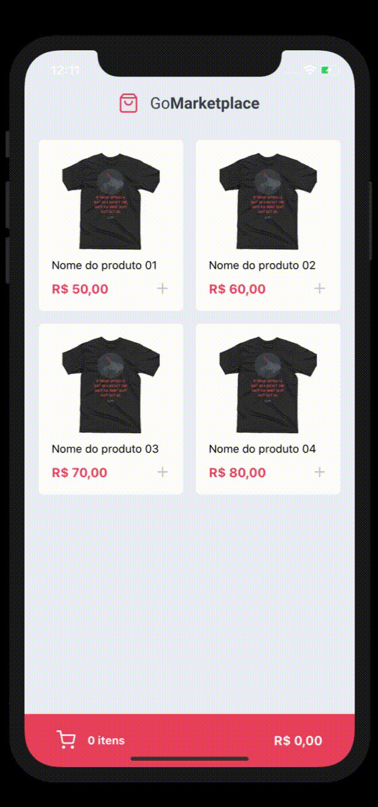

<h1 align="center">
    
    <br>

</h1>

<h4 align="center">
  Challenge to create a simple marketplace
</h4>
<p align="center">
  

  


  
  <a href="https://github.com/abauruel/MobileMarketPlace/commits/master">
    
  </a>

  <a href="https://github.com/abauruel/MobileMarketPlace/issues">
    
  </a>

  
</p>

<p align="center">
  <a href="#rocket-technologies">Technologies</a>&nbsp;&nbsp;&nbsp;|&nbsp;&nbsp;&nbsp;
  <a href="#information_source-how-to-use">How To Use</a>&nbsp;&nbsp;&nbsp;|&nbsp;&nbsp;&nbsp;
  <a href="#memo-license">License</a>
</p>

<p align="center">
  
  
</p>

## :rocket: Technologies

This project was developed with the following technologies:


-  [React-Native](https://facebook.github.io/react-native/)
-  [React Native Gesture Handler](https://kmagiera.github.io/react-native-gesture-handler/)
-  [React Navigation](https://reactnavigation.org/)
-  [styled-components](https://www.styled-components.com/)
-  [VS Code][vc] with [EditorConfig][vceditconfig] and [ESLint][vceslint]

## :information_source: How To Use

To clone and run this application, you'll need [Git](https://git-scm.com), [Node.js v10.16][nodejs] or higher + [Yarn v1.13][yarn] or higher installed on your computer. From your command line:

```bash
# Clone this repository
$ git clone https://github.com/abauruel/MobileMarketPlace

# Go into the repository
$ cd MobileMarketPlane

# Install dependencies
$ yarn install

# Run the app (iOS)
$ yarn ios

# Run the app (Android)
$ yarn android
```

## :memo: License
This project is under the MIT license. 

---

Made with ♥ by Alex Claude :wave: [Get in touch!](https://www.linkedin.com/in/alexbauruel/)

[nodejs]: https://nodejs.org/
[yarn]: https://yarnpkg.com/
[vc]: https://code.visualstudio.com/
[vceditconfig]: https://marketplace.visualstudio.com/items?itemName=EditorConfig.EditorConfig
[vceslint]: https://marketplace.visualstudio.com/items?itemName=dbaeumer.vscode-eslint
